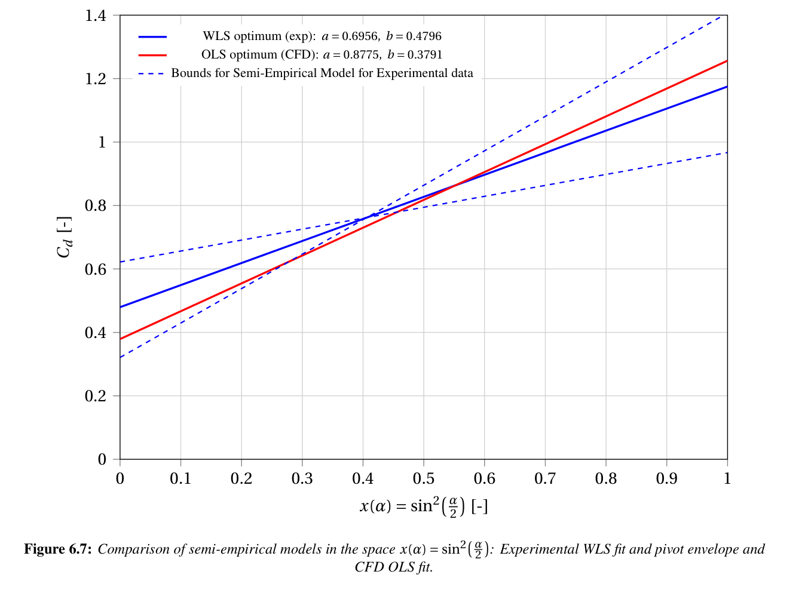

# Aerodynamic Characterization of Hollow Conical Shells in Free Fall 
### A Comparative Experimental and Numerical Study on the Geometric Dependence of Subsonic Drag Coefficients

## Project Background & Academic Context
The raw experimental kinematic data utilized in this repository was originally acquired in 2024 as part of a research project that secured me the first place at the 20th Open Inter-School Physics Competition. However, the entirety of the analytical framework, computational validation, statistical uncertainty propagation, and the final technical report were rigorously developed during my first year of Aerospace Engineering at Delft University of Technology.
This repository represents a university-level elevation of those initial empirical observations, strictly adhering to advanced scientific and metrological standards to investigate phenomena beyond the scope of the original competition.

## Abstract
This repository contains the experimental datasets, numerical models, and source code for an independent research project investigating the aerodynamic behavior of hollow conical shells. The primary objective is to bridge classical theoretical fluid dynamics (such as Newtonian impact theory) with empirical reality by systematically correlating physical free-fall kinematics with high-fidelity Computational Fluid Dynamics (CFD) predictions.

## Methodology
The research is structured around a dual-approach validation process to accurately determine drag coefficients ($C_d$) across varying bluff-body geometries ($\alpha$).

* **Acquisition of the Experimental Data** A physical experimental framework was engineered to capture the steady-state free-fall velocities of conical shells using high-framerate optical tracking. To guarantee mathematical rigor, a strict kinematic stability filter was applied to isolate purely vertical, quasi-steady descent. A comprehensive measurement uncertainty analysis was executed utilizing the Root Sum Square (RSS) framework, tightly quantifying all instrumental and propagation error margins.

* **Computational Fluid Dynamics (CFD) Validation** To correlate the experimental results with theoretical models and investigate the physical limitations of classical approximations, steady-state RANS simulations were executed. Utilizing the OpenFOAM finite-volume framework and the $k-\omega$ SST turbulence closure model, this phase successfully extracted complex near-wake topologies, quantified base-pressure drag components, and computationally derived the drag coefficients for the corresponding geometries. 

* **Data Synthesis & Modeling:** Custom Python routines were developed to synthesize the empirical and numerical data streams. These scripts automate the data processing, apply Weighted Least Squares (WLS) regression, and utilize the End-Points Pivot Rule to establish parameter envelopes, ultimately validating a corrected semi-empirical aerodynamic model.

## Computational & Analytical Stack
* **CFD Solvers & Meshing:** OpenFOAM (SIMPLE algorithm, RANS formulations)
* **Data Processing & Regression:** Python (NumPy, SciPy, Matplotlib)
* **Computer-Aided Design (CAD):** CATIA
* **Typesetting & Documentation:** LaTeX

## Key Findings
The integration of experimental kinematics with numerical CFD models yielded a strict non-linear dependence of the drag coefficient on the conical apex angle. The analysis successfully validated the semi-empirical relationship $C_d(\alpha) = a \sin^2(\alpha/2) + b$. The strictly positive intercept ($b > 0$) empirically isolates a baseline base-pressure and viscous drag component, exposing physical limitation of classical Newtonian impact theory in subsonic regimes. Moreover, the computational models validated the empirical data, falling within the defined experimental uncertainty envelope for bluff geometries ($\alpha \ge 60^\circ$). Furthermore, the study successfully isolated and quantified the aeroelastic divergence (flutter) present in highly slender geometries ($30^\circ$).

> **Note:** For a comprehensive breakdown of the mathematical derivations, boundary conditions, turbulence closure sensitivity studies, and the exact physical experimental setup, please refer to the complete technical report located in the `docs/` directory.

## Repository Structure
* `/docs` - The final technical report (PDF) detailing the theoretical background and findings.
* `/src` - Python source code for data analysis, plotting, and WLS regression modeling.
* `/data` - Experimental and CFD datasets (categorized into raw and processed) along with uncertainty calculation matrices.
* `/cfd` - CFD post-processing visualizations (including mesh configurations, wake topologies, and pressure gradients), alongside raw drag coefficient outputs for each individual conical shell.
* `/results` - Python-generated analytical outputs.

## License
This project is open-source and available under the MIT License.
