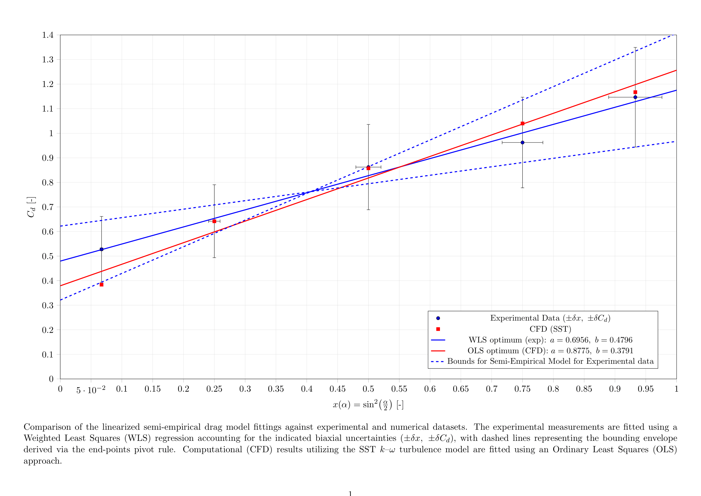

# Aerodynamic Characterization of Hollow Conical Shells in Free Fall

### The influence of apex angle on subsonic drag: a combined experimental and numerical study

**Kajetan R. Gułaj**, Faculty of Aerospace Engineering, Delft University of Technology.

---

## What this is

How does the internal apex angle of a hollow paper cone govern the drag it feels
falling apex-down? I measured terminal velocities for five cones
(30°, 60°, 90°, 120°, 150°) with mass and frontal area held constant, computed
the drag coefficients, ran matching steady RANS simulations, and fitted a
semi-empirical model to both datasets.

The drag coefficient rises from 0.528 at 30° to 1.147 at 150° and follows

```
C_d(α) = 0.6956 · sin²(α/2) + 0.4796        (R² ≈ 0.99)
```

The strictly positive intercept is the point of the exercise. Classical
Newtonian impact theory predicts `C_d = 4·sin²(α/2)`, which forces the drag to
vanish as the cone becomes slender. It does not vanish, because base pressure
and skin friction do not care how pointy the cone is.



## Background

The raw kinematic data was recorded in 2024 for a secondary-school research
project, which took first place in the 20th Open Inter-School Physics
Competition named after Bożena Koronkiewicz, under the supervision of my physics
teacher Natalia Buczak. Everything else in this repository, the uncertainty
propagation, the CFD work, the regression analysis and the current technical
report, I did afterwards during my first year of Aerospace Engineering at
TU Delft.

## Method

**Experiment.** Cones were dropped against a calibrated wall carrying three
fiducial markers 0.50 m apart, filmed at 60 fps from 4.5 m with a 70–200 mm lens
to approximate an orthographic projection. Transit times were counted frame by
frame across two consecutive 0.50 m intervals, which doubles as the check that
terminal velocity had actually been reached. Ten drops per geometry, the first
six stable ones accepted. Uncertainties were propagated by root-sum-square; the
velocity term dominates because it enters the drag coefficient squared, giving
δC_d/C_d between 17.7% and 25.4%.

**CFD.** Steady incompressible RANS with the Menter k-ω SST closure, inlet
velocity set to the measured terminal velocity for each geometry, slip far-field
boundaries, no-slip on the cone. Agreement with the measurements is within 0.6%
at 60° and 90°, 1.8% at 150° and 8.1% at 120°. The 30° cone is the outlier at
−27.3%, which I attribute to fluid-structure interaction in the thin, flexible
paper shell, something a steady rigid-body solver has no mechanism to capture.

**Analysis.** Weighted least squares for the experimental fit (the uncertainties
are heteroscedastic), ordinary least squares for the CFD fit, and the
End-Points Pivot Rule for the slope envelope, since with N = 5 a Student-t
interval is too wide to say anything useful.

## CFD limitations

This was my first time using a CFD solver, and the numerical work should be
read with that in mind:

- The simulations were run on **SimScale**, a browser-based platform, using its
  built-in meshing and its incompressible steady-state analysis type. SimScale
  runs OpenFOAM-based solvers underneath, but I did not set up, configure or run
  OpenFOAM myself, and I did not write case files by hand.
- **No mesh independence study was carried out.** Convergence was judged only
  from the force-coefficient history flattening to below 0.1% fluctuation, which
  shows the solver settled, not that the answer is grid-independent.
- Only one turbulence closure was used, so the results carry no estimate of
  closure-induced error.
- CAD geometry was built in CATIA and exported as STEP.

The agreement with experiment for the blunt geometries is good, but it is
agreement between one set of measurements and one set of simulations I produced
myself while still learning the tool, not an independent validation.

## Repository structure

| Path | Contents |
|---|---|
| `docs/` | The technical report (PDF). |
| `src/` | `linear_reg.py` — WLS/OLS fitting, End-Points Pivot Rule bounds, parameter-space scan and plots. |
| `data/` | The experimental workbook: raw frame counts, processed velocities, uncertainty calculator. |
| `cfd/` | Per-case CFD output: STEP geometry, force and moment coefficient histories, mesh, wake and pressure fields. |
| `results/` | Parameter-space scans (`.dat`), heatmaps and the final comparison figure. |

## Stack

- **CFD:** SimScale (cloud), steady incompressible RANS, SIMPLE, k-ω SST
- **CAD:** CATIA
- **Analysis:** Python — NumPy, pandas, Matplotlib
- **Report:** LaTeX

## Reproducing the analysis

```bash
pip install numpy pandas matplotlib
python src/linear_reg.py
```

This regenerates both parameter-space heatmaps and prints the WLS optimum, the
OLS optimum and the pivot bounds. The raw data is hard-coded at the top of the
script, so it runs standalone.

## License

MIT. See [LICENSE](LICENSE).
